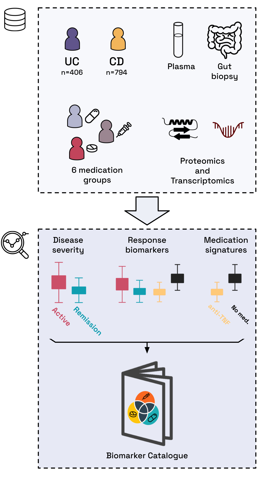

# CCF Medication Biomarker Catalog
This repository details the steps needed to reproduce the analysis described in the publication:

  

# Table of Contents 
- [Overview](#overview)
- [Citation](#citation)
- [Setup](#setup)
- [Reproducibility](#reproducibility)
	- [Data](#data)
	- [Notebooks](#notebooks)
	- [Scripts](#scripts)
- [Project Structure](#project-structure)
- [References](#references)
- [Acknowledgments](#acknowledgments)
- [License](#license)

# Overview
This repository contains code and notebooks to reproduce the analyses for CCF medication effects across transcriptomics and proteomics. The work focuses on:
- Medication family effects (each drug family vs "No Medication")
- Disease severity effects (remission vs active) within subpopulations
- Aggregation utilities and plotting helpers for downstream interpretation

Analyses are implemented as both notebooks and reproducible command-line scripts.

# Citation
[**A biomarker catalog for inflammatory bowel disease medications**, *T. J. Hart, Kiana A. West, António José Preto, Daniel Domingo-Fernández*]()

If you use this code or the derived results, please cite the associated study and this repository. A related multi-omics analysis framework and structure is inspired by:
- SPARC Multiomics analysis repository: `https://github.com/enveda/sparc-multiomics/tree/main`.
  See the SPARC repo README for an example of reproducibility structure and reporting.

# Setup
When replicating the project, we are unable to disclose the real data, as it was provided by the [Chron's and Colitis Foundation](https://www.crohnscolitisfoundation.org/) and is not open source. In such cases, notebooks indicate inputs and expected outputs to enable you to follow the processing logic.

Dependencies are managed with Poetry.
- Install Poetry (see `https://python-poetry.org/docs/`)
- From the repository root, run: `poetry install`
- Use Python 3.10 as specified in `pyproject.toml`

Optional developer tooling: ruff, black, pytest are included in the dev group.

# Reproducibility
We outline input expectations and how to reproduce key analyses either via notebooks or via scripts.

### Execution order and numbering
Numbered prefixes indicate run order. Start with data preparation, then modeling, then downstream analysis/figures.

- Notebooks (recommended order):
	1) `0_data_prep.ipynb` — prepare processed dataframes and feature lists
	2) `1_metadata_analysis.ipynb` — exploratory metadata QC and plots
	3) **Run Scripts**
	4) `3_analysis/...` — aggregation, significance tables, visualizations
	5) `4_paper_plots/...` — final figure generation

- Scripts (align with notebook numbering):
	1) `scripts/2.1_run_modeling_med_vs_no_med.py` — medication vs no medication analysis
	2) `scripts/2.2_run_modeling_rem_vs_active.py` — remission versus active disease analysis

Minimal run path if you have processed inputs:
1) Run `0_data_prep.ipynb` (or ensure `data/processed_dataframes/*` exist)
2) Run one or both scripts depending on the goal
3) Run downstream notebooks in `3_analysis/` and `4_paper_plots/`

### Data
Expected processed inputs are under `data/processed_dataframes/`:
- `transcriptomics_dataframe.parquet`
- `proteomics_dataframe.parquet`
- `transcriptomics_dataframe_remission.parquet`
- `transcriptomics_dataframe_active.parquet`
- `proteomics_dataframe_remission.parquet`
- `proteomics_dataframe_active.parquet`
- `transcriptomics_gene_cols.txt` (one feature per line)
- `proteomics_protein_cols.txt` (one feature per line)

Outputs are written under `data/results/` in the following subfolders:
- `med_vs_no_med/transcriptomics/` and `med_vs_no_med/proteomics/`
- `rem_vs_active/transcriptomics/` and `rem_vs_active/proteomics/`
- Aggregated result tables are written as parquet files, e.g.:
	- `med_vs_no_med` → `agg_med_vs_no_med_transcriptomics_results.parquet`, `agg_med_vs_no_med_proteomics_results.parquet`
	- `disease_severity` → `agg_rem_vs_active_transcriptomics_results.parquet`, `agg_rem_vs_active_proteomics_results.parquet`

Directory paths and filenames are centralized in `ccf_medication/constants/pathing.py` and `ccf_medication/constants/tables.py`.

### Notebooks
Notebooks in `notebooks/` mirror the scripted analyses and exploratory data analysis. Since raw data cannot be shared, notebooks document start and end points so you can follow transformations, filtering, and modeling set-up.

### Scripts
Two primary entry points reproduce the core modeling results. Run them from the repo root with Poetry.

1) Medication vs No Medication (per drug family)
- Script: `scripts/2.1_run_modeling_med_vs_no_med.py`
- Purpose: Mixed-effects modeling comparing each medication group (e.g. TNF-α inhibitors) vs "No Medication" across transcriptomics and proteomics, split by relevant subpopulations (diagnosis, tissue for transcriptomics).
- Example:
	- `poetry run python scripts/2.1_run_modeling_med_vs_no_med.py`
- Outputs:
	- Per-split CSVs for fold-changes under `data/results/med_vs_no_med/*`
	- Aggregations saved to `data/processed_dataframes/agg_med_vs_no_med_*.parquet`

2) Disease Severity (Remission vs Active)
- Script: `scripts/2.2_run_modeling_rem_vs_active.py`
- Purpose: Mixed-effects modeling of `remission` vs `active` severity within each split and drug family; also aggregates per-split results.
- Example:
	- `poetry run python scripts/2.2_run_modeling_rem_vs_active.py`
- Outputs:
	- Per-split CSVs saved under `data/results/rem_vs_active/*`
	- Aggregations saved to `data/processed_dataframes/agg_rem_vs_active_*.parquet`

Implementation details live in `ccf_medication/models/calls.py` (e.g., `run_me_model_analysis`, helpers) and `ccf_medication/models/mixed_effects.py`.

# Project Structure
- `ccf_medication/`
	- `constants/`: paths, thresholds, labels, plotting maps
	- `models/`: mixed effects modeling, significance, orchestration
	- `plotting/`: heatmaps, volcano and strip plots, utilities
	- `utils/`: loading, file validation, general helpers
- `scripts/`: reproducible CLI entry points for analyses
- `notebooks/`: exploratory and paper-figure notebooks
- `data/`: processed inputs and results (not versioned raw data)

# References
- SPARC Multiomics repository (much of the data preprocessing comes from this repo): `https://github.com/enveda/sparc-multiomics/tree/main`

# Acknowledgments
The results here are partly based on data from the Crohn’s & Colitis Foundation’s IBD Plexus platform and SPARC IBD cohort. We thank the Foundation and participating patients and sites.

# License
This project is licensed under the terms of the LICENSE file included in this repository.
